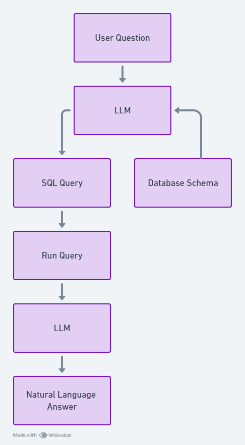

# SQL Chatbot with Gemini Pro using Natural language

Welcome to the SQL Chatbot project! This application allows users to interact with a SQL database through a conversational AI interface. Using **Gemini Pro**—an open-source large language model (LLM)—this chatbot converts natural language questions into SQL queries, connects to a database, and retrieves answers for the user. This project is built for accessibility, enabling non-technical users to explore and understand data without needing SQL expertise.

## Table of Contents
- [Overview](#overview)
- [Key Features](#key-features)
- [Tech Stack](#tech-stack)
- [Explanation of How the Chatbot Works](#Explanation-of-How-the-Chatbot-Works)

## Overview
The SQL Chatbot was developed to make data retrieval from SQL databases easier and more intuitive. By entering questions in plain language, users can interact directly with the database without writing SQL queries. The bot also includes memory capabilities, allowing for smooth follow-up questions and more conversational interactions.

## Key Features
- **Natural Language to SQL Query Translation**  
   Uses **Gemini Pro** to translate user questions into accurate SQL queries.
  
- **Conversational Memory**  
   Implements memory to enable seamless follow-up questions and context retention, enhancing the user experience.

- **SQL Database Connectivity**  
   Connects to a SQL database to execute queries and retrieve data.

- **User-Friendly Chat Interface**  
   Built with **Streamlit** to provide a simple and accessible frontend where users can type questions and view results.

## Tech Stack
- **Gemini Pro** - Large Language Model for generating SQL from natural language
- **Python** - Core programming language
- **Streamlit** - Framework for creating an interactive web interface
- **LangChain** - For integrating and managing LLM-based workflows

## Explanation of How the Chatbot Works

